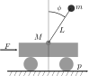

This repository contains a PIP package which contains a collection of control theory environments compatible with the OpenAI gym toolkit.


## Installation

Install the [OpenAI gym](https://gym.openai.com/docs/).

Then install this package via

```
pip install -e .
```

## Usage

```
import gym
import gym_control

env = gym.make("CartPoleControl-v0")
```

Inspired from examples found at https://github.com/matthiasplappert/keras-rl/tree/master/examples


## The Environments

### CartPoleControl

A cart-pole system. The control objective is to stabilize the pendulum in the upright vertical position (around $phi=0$).



### ArxIdentification

Given an ARX system, try to maximize the information matrix!
